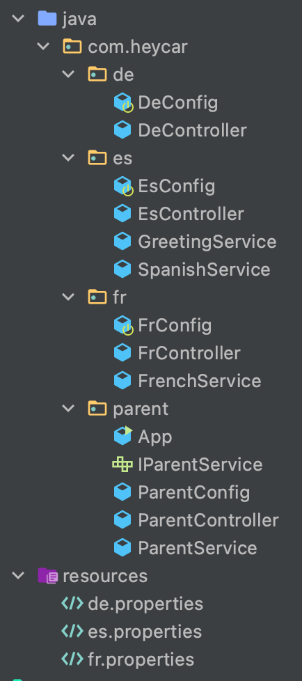

## Spring Boot Context Fluent
### Context Hierarchy with the Spring Boot Fluent Builder API
###### Keywords: Spring, Spring Context, SpringApplicationBuilder

With SpringApplicationBuilder, we can simply change some of the application default settings before the application starts. So with few lines of code, we can build different applications with different settings for different purposes while the actual underlying business logic remains the same.

Main Features of the SpringApplicationBuilder are:

Build multiple applications exposed on different ports under one Spring Boot project.
Build a Hierarchy of Contexts:  Parent, Child and Sibling.

### Use Case (poc):

We create one Springboot application with one Parent Package for the common core-code, such as models and entities and core business logic. Before the start of the project we fetch the environment variable application_country, so we can launch the application with a specific context: a Child Context. In this case, the child context is a set of services, either inherited from the Parent package, inherited with overriding services, or a totally new service that is introduced specifically to that child context.  

In this way, we can start one Parent Context and country-specific Child Context on multiple separate k8s clusters, k8s contexts or namespaces.  

In this screenshot, we can see the parent context and three other contexts, named after the application_country, de, es and fr.

#### Main features:
* A context can inherit from the parent context so it has no extra services or business logic. (de)
* A context inherits a service from the parent service but overrides it with extra functionalities/business logic. (fr)
* A service inherits a service from its parent, overrides it with extra functionalities/business logic. (es)
* A service can have its own service that is not shared with other contexts. (es)
* Controllers in all contexts are extended by the parent controller and can have their own endpoints.

  
  
  
  
  
  
  

### High Level Architecture on a K8s cluster

### Relevant Articles:

- [Context Hierarchy with the Spring Boot Fluent Builder API](https://www.baeldung.com/spring-boot-context-hierarchy)

